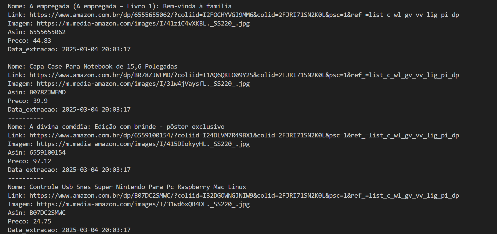

# Lista de desejos - Amazon Scraper (BR) 🛒  

Script Python em desenvolvimento para extrair dados de listas de desejos da Amazon Brasil (amazon.com.br) usando **Selenium** e **BeautifulSoup**.  
*(Desenvolvido para fins educacionais. Respeite os termos de serviço da Amazon!)*  

---

## Funcionalidades Implementadas ✨  
- Extrai **nome do produto**, **preço**, **link**, **ASIN**, **imagem** e **data de extração**.  

---

## Funcionalidades Planejadas 🚧  
- **Salvar em Banco de Dados**:  
  - Integração com SQLite para armazenamento persistente.  
  - Tabelas históricas para rastreamento de mudanças.  

- **Comparação de Preços Históricos**:  
  - Dashboard para visualização de variações de preço.  
  - Alertas automáticos de preços.  

- **Exportação Multi-Formato**:  
  - Suporte para CSV, Excel e Google Sheets.  

## Capturas de Tela 📸

